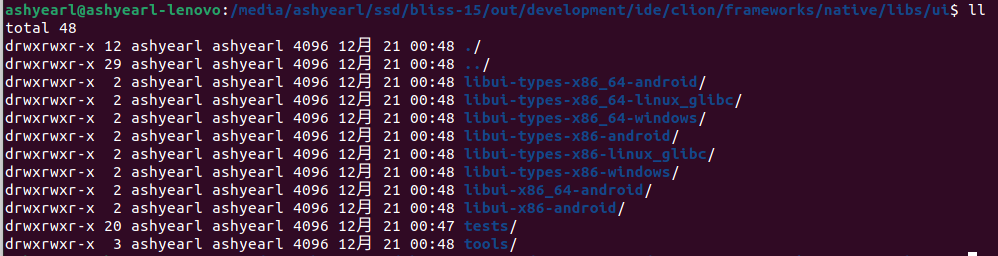

可以使用`Clion`来阅读和编辑AOSP的源码，它提供了良好的代码跳转和搜索功能，该方法只用于阅读，不能使用`Clion`来编译。完成后会在`out/development/ide/clion/`目录下生成对应的子项目的`CMakeLists.txt`文件用于`Clion`导入项目[原文参见这里](https://android.googlesource.com/platform/build/soong/+/HEAD/docs/clion.md)

1. 设置环境变量
```bash
export SOONG_GEN_CMAKEFILES=1
export SOONG_GEN_CMAKEFILES_DEBUG=1
```
2. 正常完整编译系统源码(因为模块之间的相互依赖，完全编译会避免很多缺失自动生成的文件的问题)
```bash
source build/env.sh
lunch xxx
make
```
3. 同时编辑多个项目（由于一个模块依赖多个其他模块），以Allocer为例,在任意目录中创建CMakeLists.txt：
```cmake
cmake_minimum_required(VERSION 3.6)
project(allocer)

# 设置ROOT变量，指向生成的CMakeLists.txt的根目录
set(ROOT /media/ashyearl/ssd/bliss-15/out/development/ide/clion)
message(${ROOT})

# 添加子项目
```
4. 添加子项目

当要分析一个类，但是不知道它在哪个模块时，可以用`Google`或者`cs.android.com`来快速定位它所在模块


这里的`frameworks/native/libs/ui`就是它所在的模块, 同时在`out/development/ide/clion`目录下可以找到子项目，`libui-x86_64-android`就是该项目的CMakeLists.txt生成的目录，加入即可

```cmake
# 这里使用显式声明子项目编译目录的方式，因为它的源码不在当前的总CMakeLists.txt目录下
add_subdirectory(${ROOT}/frameworks/native/libs/ui/libui-x86_64-android libui)
```

5. 按照同样的方法添加其他依赖的、需要编辑查看的子项目