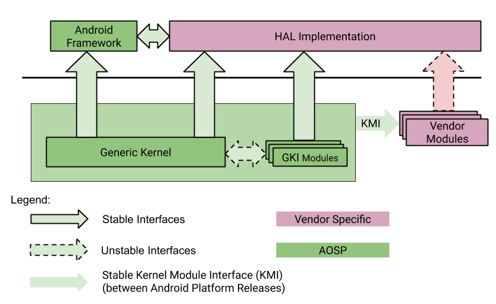

`ACK`: [Android Common Kernel](https://source.android.com/devices/architecture/kernel#ack)
> A kernel that is downstream of a LTS kernel and includes patches of interest to the Android community that haven't been merged into Linux mainline or Long Term Supported (LTS) kernels. Newer ACKs (version 5.4 and above) are also known as GKI kernels as they support the separation of hardware agnostic Generic Kernel code and hardware agnostic GKI modules.

`GKI`: [Generic Kernel Image](https://source.android.com/devices/architecture/kernel/generic-kernel-image)
> Any newer (5.4 and above) ACK kernel (currently aarch64 only). This kernel has two parts: The core GKI kernel with code common across all devices and GKI kernel modules developed by Google that can be dynamically loaded on devices where applicable.

`KMI`: [Kernel Module Interface]()
> An interface between the GKI kernel and vendor modules allowing vendor modules to be updated independently of the GKI kernel. This interface consists of kernel functions and global data that have been identified as vendor/OEM dependencies using per-partner symbol lists.
> 


Kernel config位于`<AOSP>/kernel/kernel/configs`

可以使用下面的方法列出pice设备：
> lspci -k

### 编译中的一些工具或方法
- 常用的配置编辑：
  ```bash
  // Open
  make menuconfig
  // 可以使用'/'来搜索config symbol, 使用左边出现的数字来直接跳转到位置
  /hotplug
  // 可以使用'/^xxx'来搜索帮助信息中的关键字
  ```
- kernel panic代码位置查找
  ```bash
  错误中会有 RIP:0010:ehci_hub_control+0xc8a
  可以用gdb查找代码位置：
  gdb vmlinux

  (gdb) l *ehci_hub_control+0xc8a
  0xffffffff81ae9c4a is in ehci_hub_control (drivers/usb/host/ehci-hub.c:1168).
  ```
- 可以使用下面的方法指定config文件路径
  ```bash
  KCONFIG_CONFIG=../out/android12-5.10/earl/.config make menuconfig
  ```

[开启MMC debug log](https://www.cnblogs.com/YYFaGe/p/15905264.html)