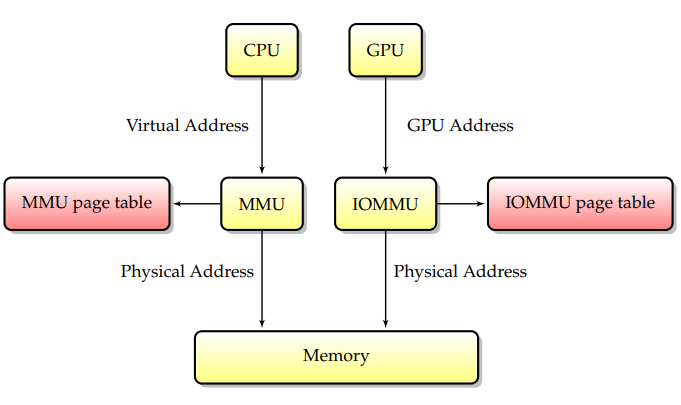
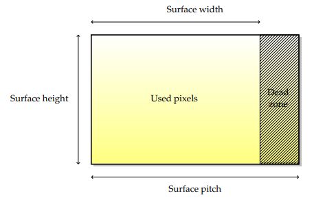

[原文Pdf](https://people.freedesktop.org/~marcheu/linuxgraphicsdrivers.pdf)

## 总线
| Bus type          | Bus width | Frequency      | Bandwidth          | Capabilities  |
| ----------------- | --------- | -------------- | ------------------ | ------------- |
| PCI               | 32 bits   | 33 Mhz         | 133 MB/s (33 Mhz)  | -             |
| AGP               | 32 bits   | 66 Mhz         | 2100 MB/s (8x)     | SBA, FW, GART |
| PCI-X             | 64 bits   | 33, 66,133 Mhz | 533 MB/s (66 Mhz)  | -             |
| PCI-Express (1.0) | Serial    | 1.25 Ghz       | 4 GB/s (16 lanes)  | -             |
| PCI-Express (3.0) | Serial    | 4 Ghz          | 16 GB/s (16 lanes) | -             |
> PCI: (Peripheral Component Interconnect)

## 物理和虚拟内存

主要有3中缓存模型：
- UC (UnCached) memory is uncached. CPU读写无缓存，直接对物理内存读写
- WC (Write Combine) memory is uncached. 内存合并写，减少写入次数
- WB (Write Back) memory is cached. 默认模式，CPU访问性能最佳，内存不会立即写入到物理内存中
> memory barriers用于解决缓存模式(Write-Combine和Write-Back)下GPU访问的读取时序问题。

## Surface
`Surface`在存储时横向由于硬件限制以`pitch`(bytes)为单位计算，导致会有未使用的区域。即`Surface`占用的内存大小为： pitch * height, 而不是 width * height * bpp

