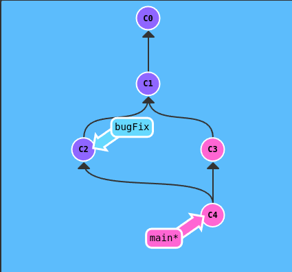
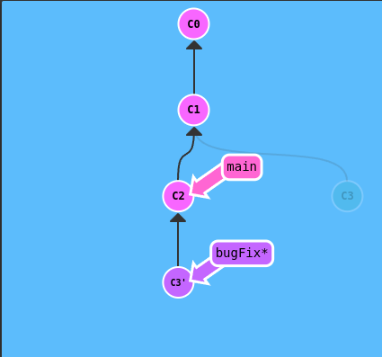
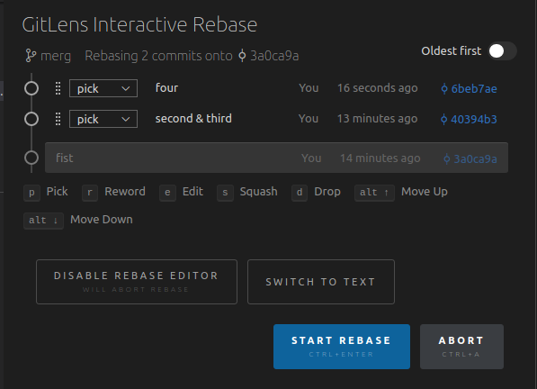
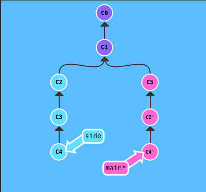
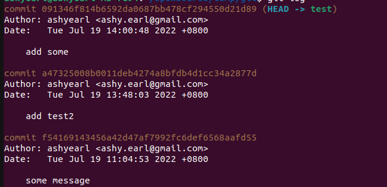
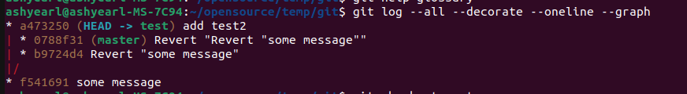
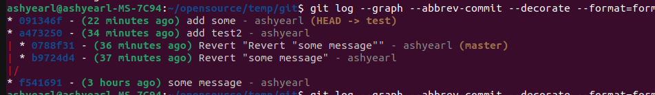
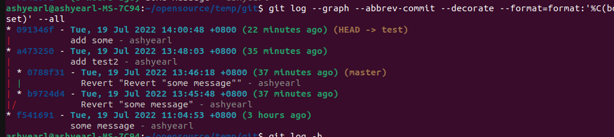
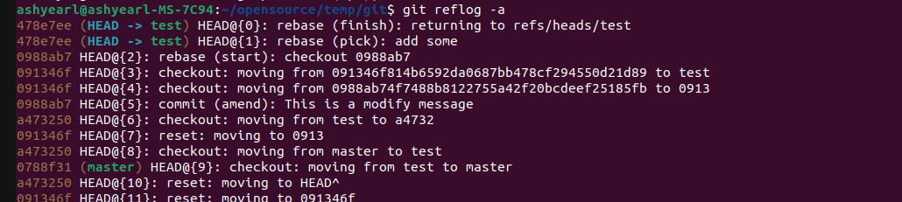
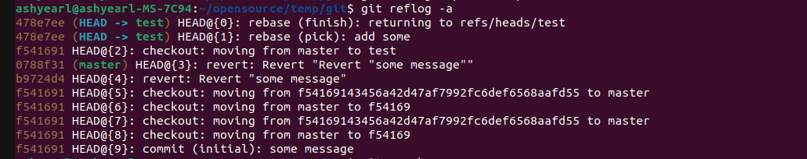

- [交互式Git学习看这里](https://learngitbranching.js.org/)


## 初始化仓库
```bash
# 在当前目录初始化git仓库
$ git init
# 完成后的目录结构
$ tree -a .
.
└── .git
    ├── branches
    ├── config
    ├── description
    ├── HEAD
    ├── hooks
    │   ├── applypatch-msg.sample
    │   ├── commit-msg.sample
    │   ├── fsmonitor-watchman.sample
    │   ├── post-update.sample
    │   ├── pre-applypatch.sample
    │   ├── pre-commit.sample
    │   ├── pre-merge-commit.sample
    │   ├── prepare-commit-msg.sample
    │   ├── pre-push.sample
    │   ├── pre-rebase.sample
    │   ├── pre-receive.sample
    │   ├── push-to-checkout.sample
    │   └── update.sample
    ├── info
    │   └── exclude
    ├── objects
    │   ├── info
    │   └── pack
    └── refs
        ├── heads
        └── tags

10 directories, 17 files
```
可以加上`-b branchName`来指定初始化分支名称, 当然也可以在初始化完成后来修改
```bash
$ git branch -m newName
```
## 添加修改
```bash
# 将 pathspec 添加到暂存区, 可以多个路径
$ git add <pathspec>...
# 类似的：添加当前目录所有修改，包含修改文件和未跟踪文件
$ git add .

# 将 pathspec 从暂存区及文件系统移除， 可以多个路径
$ git rm <pathspec>...
# 如果不想删除文件，只是要从暂存区移除用于提交可以
$ git rm --cached <pathspec>...
# 当文件从文件系统删除后，也可以添加该删除记录到暂存区
$ git add path/to/delete/file

# 文件重命名, 同时修改暂存区和文件系统
$ git mv <source>... <destination>
# 如果文件已经移动，该文件之前已经提交/暂存过，git会比对文件内容自动生成mv操作
# 例如： temp是暂存的文件，然后被其他工具移动了
$ echo temp > temp
$ git add temp
$ git commit -m "add temp for test git mv"
$ mv temp temp2
# git状态就会显示它是删除了
$ git status
On branch master
Changes not staged for commit:
  (use "git add/rm <file>..." to update what will be committed)
  (use "git restore <file>..." to discard changes in working directory)
	deleted:    temp

Untracked files:
  (use "git add <file>..." to include in what will be committed)
	temp2
# 这时就可以通过下面的方式，git会对比文件内容来完成mv（即使修改文件时间、权限等）
$ git rm temp
$ git add temp2
$ git status
On branch master
Changes to be committed:
  (use "git restore --staged <file>..." to unstage)
	renamed:    temp -> temp2
```
## 提交修改
```bash
# 提交暂存区中的修改, 默认无路径时提交所有修改
$ git commit <pathspec>...
# 可以直接添加简短的提交信息
$ git commit -m "This is a short commit message"

# 默认会使用系统的`editor`来编辑提交信息，可以通过下面的方法修改编辑器
$ git config core.editor "vim"
$ export EDITOR="vim"
# 或者设置全局设置，在所有git仓库中缺省生效
$ git config --global core.editor "vim"
# 或者使用vscode
$ git config core.editor "code --wait"
```

## 分支
分支在git只是commit的一个指针，因此分支十分的轻量，分支的创建和销毁都很快
```bash
# 列出当前的本地分支, 其中带*号的是当前分支
$ git branch
# 在commit创建feature分支，省略commit时为在当前commit创建，创建完成后依然停留在当前commit
$ git branch [feature] [commit]
# 例如：
$ git branch test
$ git branch
* master
  test

# 切换到指定分支（该分支成为当前分支），并更新文件系统
$ git checkout [branch-name]
# 切换到上一个分支
$ git checkout -
# 创建新的分支指向commit，省略commit时指向当前commit
$ git checkout -b [branch-name] [commit]

```

## merge/rebase 分支
merge将会保留被merge的分支历史在单独的支线里（不同与rebase会将历史合并进同一条分支历史）
- 左边为：当前分支main，merge bugFix到main分支(`git merge bugFix`)
- 右边为：当前分支bugFix, rebase到main分支(`git rebase main`)
> 左边merge完后bugFix是main的父commit，因此`git checkout bugFix && git merge main`bugFix会和main指向同一commit

> 右边main是bugFix的父commit，因此`git checkout main && git rebase bugFix`bugFix会和main指向同一commit

  
```bash
# 合并指定commit或分支到当前分支
$ git merge [<commit-merge-from>...]

# rebase当前分支到指定分支，当前分支将会基于新的base commit
$ git rebase <branch-rebase-on>

# rebase 当前分支到指定的commit(upstream), 使用外部交互式编辑器（可以用vscode，更直观）
$ git rebase -i [<upstream> [<branch>]]

# 仅rebase topic分支，不包含next
    o---o---o---o---o  master
         \
          o---o---o---o---o  next
                           \
                            o---o---o  topic
# 目标rebase结果为
    o---o---o---o---o  master
        |            \
        |             o'--o'--o'  topic
         \
          o---o---o---o---o  next
# 可以使用下面的方法
git rebase --onto master next topic
```
交互式rebase时会有选择commit怎么rebase的选项, vscode中显示如下, commit可以拖动重新排序，也可以选择不同的操作方式



| 命令   | 说明                                                   |
| ------ | ------------------------------------------------------ |
| pick   | 保留commit和其注释                                     |
| reword | 保留commit，编辑注释                                   |
| edit   | 保留commit，执行到该commit时可以修改内容，添加删除文件 |
| squash | 保留commit，合并到前一个commit                         |
| fixup  | 类似squash，但丢弃注释                                 |
```bash
# Commands:
# p, pick <commit> = use commit
# r, reword <commit> = use commit, but edit the commit message
# e, edit <commit> = use commit, but stop for amending
# s, squash <commit> = use commit, but meld into previous commit
# f, fixup [-C | -c] <commit> = like "squash" but keep only the previous
#                    commit's log message, unless -C is used, in which case
#                    keep only this commit's message; -c is same as -C but
#                    opens the editor
# x, exec <command> = run command (the rest of the line) using shell
# b, break = stop here (continue rebase later with 'git rebase --continue')
# d, drop <commit> = remove commit
# l, label <label> = label current HEAD with a name
# t, reset <label> = reset HEAD to a label
# m, merge [-C <commit> | -c <commit>] <label> [# <oneline>]
# .       create a merge commit using the original merge commit's
# .       message (or the oneline, if no original merge commit was
# .       specified); use -c <commit> to reword the commit message
```

## commit/branch 引用
`HEAD`是git中一个特殊的指针，指向了当前检出的commit，可以使用下面的方法索引commit
- `HEAD^`: 指向HEAD commit的前一个commit，等同于`HEAD^1`
- `HEAD^n`: 指向HEAD commit的前n个commit
- `HEAD~`: 指向HEAD commit的前一个commit，前面没有分支时等同于`HEAD^`
- `HEAD~n`: 指向HEAD commit的前n个commit，前面没有分支时等同于`HEAD^n`
- 分支操作：上面的图中（main为当前分支，HEAD位于C4），`HEAD^1~1`可以引用C3, `HEAD^2~1`可以引用C2, 当然也可以用`main^2~1`
```bash
# 当前HEAD指向了master分支，也就是唯一的这个commit
$ git log
commit f54169143456a42d47af7992fc6def6568aafd55 (HEAD -> master, test)
Author: ashyearl <ashy.earl@gmail.com>
Date:   Tue Jul 19 11:04:53 2022 +0800

    some message
# git可以检出时只使用前几个hash字符（只要唯一，测试最少两个字节，即f541）就可以检出该commit，将HEAD切换到这里
$ git checkout f541691
Note: switching to 'f541691'.

You are in 'detached HEAD' state. You can look around, make experimental
changes and commit them, and you can discard any commits you make in this
state without impacting any branches by switching back to a branch.

HEAD is now at f541691 some message
# 查看当前状态
$ git status
HEAD detached at f541691
nothing to commit, working tree clean
$ git branch -a
* (HEAD detached at f541691)
  master
  test

# 修改当前节点的提交信息（会生成新的commit替代当前commit）
$ git commit --amend
```

## reset/revert
- reset 用于重置当前HEAD到指定的commit，如果HEAD指向对应分支则同时重置分支，变相的reset可以让分支在各个commit间游走。
  ```bash
  # 仅重置HEAD, 默认不会修改文件系统
  $ git reset --soft <commit>
  # 同时重置当前文件系统, 
  $ git reset --hard <commit>
  ```
- revert 用于重置远程仓库，远程仓库不能使用reset来回滚
  ```bash
  $ git revert <commit-ish>...
  ```

## cherry-pick
`cherry-pick`可以选择指定的commit加入到当前分支,下图中的`C2'`, `C3'`就是从side分支上pick过来的(是新的commit)。
```bash
# 可以随意选择要pick的commit
$ git cherry-pick <commit-ish>...
# 例如上图中，main分支之前位于C5 commit
$ git cherry-pick C2 C3
# 也可以使用, 两个点指代开始不包含
$ git cherry-pick C1..C3
# 或者，三个点指代包含
$ git cherry-pick C2...C3
$ git cherry-pick C2^..C3
```


## log
`git log`可以显示当前commit或者指定commit的log日志
- `git log`
  
  
- `git log --all --decorate --oneline --graph`
  
- `git log --graph --abbrev-commit --decorate --format=format:'%C(bold blue)%h%C(reset) - %C(bold green)(%ar)%C(reset) %C(white)%s%C(reset) %C(dim white)- %an%C(reset)%C(bold yellow)%d%C(reset)' --all`
  
- `git log --graph --abbrev-commit --decorate --format=format:'%C(bold blue)%h%C(reset) - %C(bold cyan)%aD%C(reset) %C(bold green)(%ar)%C(reset)%C(bold yellow)%d%C(reset)%n''          %C(white)%s%C(reset) %C(dim white)- %an%C(reset)' --all`
  
- 可以通过设置别名的方式来快速使用这些命令
  ```bash
  # adog: 后面参数的首字母
  $ git config alias.adog "log --all --decorate --oneline --graph"
  # bdog: 沿用adog，好记
  $ git config alias.bdog "log --graph --abbrev-commit --decorate --format=format:'%C(bold blue)%h%C(reset) - %C(bold green)(%ar)%C(reset) %C(white)%s%C(reset) %C(dim white)- %an%C(reset)%C(bold yellow)%d%C(reset)' --all"
  # cdog: 沿用adog，好记
  $ git config alias.cdog "log --graph --abbrev-commit --decorate --format=format:'%C(bold blue)%h%C(reset) - %C(bold cyan)%aD%C(reset) %C(bold green)(%ar)%C(reset)%C(bold yellow)%d%C(reset)%n''          %C(white)%s%C(reset) %C(dim white)- %an%C(reset)' --all"
  ```

## fsck/reflog/gc
- reflog: 可以查看最近的HEAD相关的操作历史记录,左边为HEAD hash，右边为简短说明，可以用来找回无引用的commit。Git默认会用reflog引用这些commit，因此他们不是`unreachable`，可以用下面的命令清除log来删除它(下面0913的commit没了)
  
  ```bash
  # 强制现在为止的unreachable记录过期（正常的记录还在），也就不会再引用那些commit
  $ git reflog expire --expire-unreachable=now --all
  # 也可以使用删除来处理单条记录
  $ git reflog delete HEAD@{2}
  ```
  
- 当使用`rebase`,`commit --amend`,`branch -f`等命令后会导致部分commit没有其他分支或tag引用，默认再找不到它了，可以用下面的命令找到这些commit:
  ```bash
  # fsck用于校验commit的连接性和可用性
  $ git fsck --no-reflogs
  Checking object directories: 100% (256/256), done.
  dangling commit 091346f814b6592da0687bb478cf294550d21d89
  ```
- gc: 对于`unreachable`commit的清理，默认gc会有两周时间保留，可以指定时间来快速删除
  ```bash
  # 立即清理，之后那些unreachable commit就不能再访问了（git show commit找不到了）
  $ git gc --prune=now
  ```

## tag/describe
- tag: 分支可以使用上面的方法游走，修改，对于发布版本需要tag来固定历史和commit
  ```bash
  # 列出所有tag
  $ git tag
  # 新建一个tag在指定commit, commit为空指在当前commit上
  $ git tag [tag] [commit]
  ```
- describe: 可以用来查看当前commit离指定ref有多远
  ```bash
  # describe格式：
  <tag>_<numCommits>_g<hash>
  # 例如：
  $ git describe <commit-need-describe-from-last-tag>
  $ git describe tset
  init-2-g478e7ee
  ```

## remote 
- 常见命令
  ```bash
  # 将远程仓库检出到本地，本地会有其镜像，例如：
  # 远程仓库名称：origin, 远程分支： master
  # 检出到本地分支： origin/master, 这个分支是无法直接编辑的
  $ git clone remote-
  
  # 下载远程仓库的所有变动, fetch只干两件事：1.下载commit，2.更新本地镜像分支指针（如： origin/master）
  $ git fetch [remote]
  # 取回远程仓库的变化，并与本地当前分支合并
  $ git pull [remote] [branch]
  # 等同于
  $ git fetch [remote] [branch] && git merge remote/branch
  
  # 上传本地指定分支到远程仓库, 同时更新本地镜像分支指针, 后面两个参数可以为空，将为推送当前分支到其追踪的远程分支
  $ git push [remote] [branch]


  # 显示所有远程仓库
  $ git remote -v
  # 显示某个远程仓库的信息
  $ git remote show [remote]
  # 增加一个新的远程仓库，并命名
  $ git remote add [shortname] [url]

  ```
- 平常的操作流程
  ```bash
  # 发布前先获取最新的更新
  $ git fetch
  # rebase到最新的commit上, 这里的远程仓库名称和分支名称按实际情况而定
  $ git rebase origin/master
  # 发布新commit
  $ git push
  ```
- remote track
  ```bash
  # 检出远程分支到新分支mybranch,并追踪远程分支（后续的push会更新origin/master的位置）
  $ git checkout -b mybranch origin/master
  # 也可以使用branch操作设置远程追踪分支, 如果mybranch是当前分支，后面的参数mybranch可省略
  $ git branch -u origin/master mybranch

  # 也可以将本地的source分支或commit推送到远程分支destination中
  $ git push origin <source>:<destination>
  # 也可以推送到远程新分支，git会自动创建远程分支和对应的本地镜像
  $ git push origin master:newBranch
  # 也可以检出远程分支中的某个commit为本地新分支
  $ git fetch origin master^2:mylocalBranch

  # 特殊：可以删除远程分支
  $ git push origin :branchWantDelete
  # 特殊：创建了本地分支(在当前commit)
  $ git fetch origin :newLocalBranch
  ```

## 查看版本间的提交记录
  ```bash
  git log --oneline --no-merges android-platform-12.0.0_r12..android-platform-12.0.0_r15
  ```