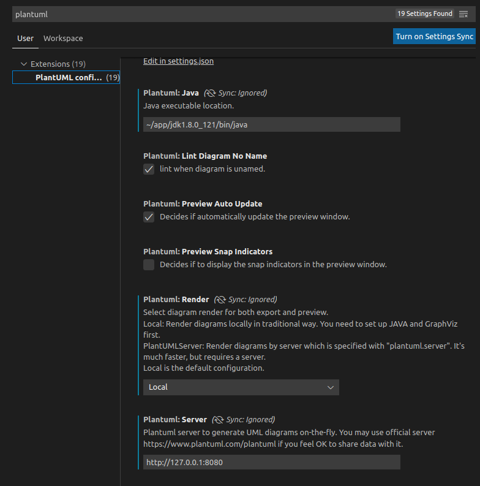
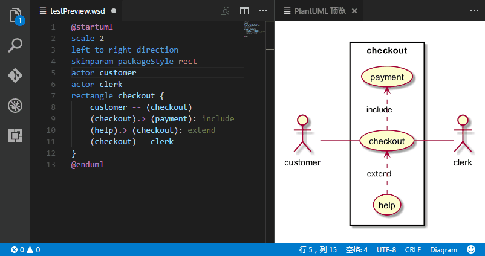
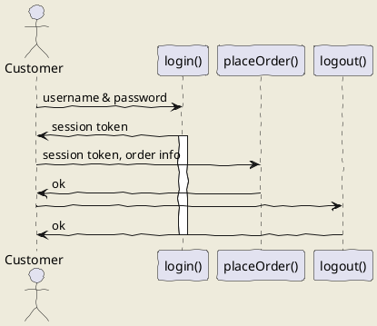
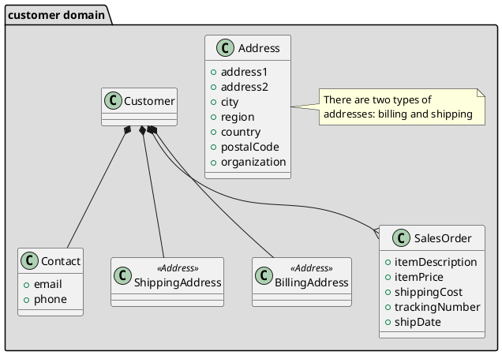
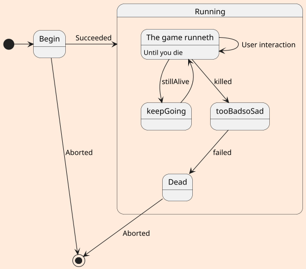

`PlantUML`支持从`PlantUML code`生成UML图，不用手动画了，[插件文档参见这里](https://marketplace.visualstudio.com/items?itemName=jebbs.plantuml)
### 支持的格式
```bash
*.wsd, *.pu, *.puml, *.plantuml, *.iuml
```
### 安装
- 安装Vscode插件： plantuml
- 安装render(用于渲染UML图)，有两种方法：
  1. Local Render:
    - 安装`Java`环境，也可以下载后在设置里配置`java`位置
      
    - 安装`graphviz`
        ```bash
        $ sudo apt install graphviz
        ```
  2. 使用`PlantUML server`
    - 使用官方的服务
      ```url
      https://www.plantuml.com/plantuml
      ``` 
    - 自己搭建, 从[这里](https://github.com/plantuml/plantuml/releases)下载最新的jar包：
      ```bash
      $ ~/app/jdk1.8.0_121/bin/java -jar plantuml-1.2022.6.jar -picoweb
      // 运行后配置下面的摄者
      "plantuml.server": "http://127.0.0.1:8080",
      "plantuml.render": "PlantUMLServer",
      ``` 
### 一些Demo
自动更新

序列图


### uml: class diagram




## uml: state diagram
